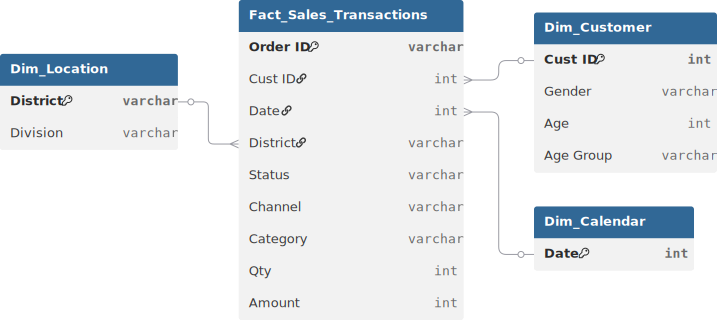

# 📊 Project Background: DeshiMart E-Commerce Annual Report

**DeshiMart .com** is a leading multi-channel e-commerce aggregator in Bangladesh, facilitating sales through major platforms like **Daraz, PriyoShop, Pickaboo, and Chaldal**. Despite having a wide reach across divisions like **Dhaka, Chittagong, and Khulna**, the company suffered from **"Channel Blindness."** With data fragmented across five different platforms, management couldn't identify which channels were cost-effective, which demographics were driving high-value orders, or why certain categories like "Home Appliances" saw high cancellation rates.

**The mission was to create a "Unified Source of Truth."** As a Business Analyst, I consolidated a year's worth of multi-channel transaction data to perform a comprehensive Annual Strategic Audit. I aimed to decode the purchasing power of different age groups (Millennials vs. Gen X) and provide a roadmap for optimizing marketing spend across platforms to maximize net revenue and minimize order friction.

Insights and recommendations are provided on the following key areas:

* **Channel Efficiency** (Daraz vs. Local Platforms)
* **Demographic Dominance** (Gender & Age Group Analysis)
* **Geographic Concentration** (Division-Level Sales Density)
* **Product Category Trends** (Sports vs. Home Appliances)

https://github.com/user-attachments/assets/9d71fe0c-1a15-4d15-9b07-2fc647107e23https://github.com/user-attachments/assets/9d71fe0c-1a15-4d15-9b07-2fc647107e23

[The analytical calculations were performed using Microsoft Excel's Pivot Table features.]

**Power Query M Code regarding data preparation process of the sales table can be found [[here]](https://github.com/mehedibhai101/E-Commerce_Annual_Report/tree/main/Data%20Cleaning).**

---

# 🏗️ Data Structure & Investigative Scope

The analysis was performed on a comprehensive **annual sales dataset**, mapping customer behavior across multiple digital storefronts in Bangladesh.

* **`Order Metrics`:** `Amount`, `Quantity`, `Order Status` (Delivered, Cancelled), and `Currency`.
* **`Customer Intelligence`:** Segmentation by `Gender`, `Age`, and `Age Group` (Millennial, Gen X, Boomer).
* **`Platform Analysis`:** Comparison of `Channels` including **Daraz, AjkerDeal, Chaldal, Pickaboo, and PriyoShop**.
* **`Product Hierarchy`:** Performance tracking of categories like **Sports, Home Appliances, and Health Care**.
* **`Geographic Tiers`:** Multi-level mapping from **District** to **Division** (e.g., Dhaka, Chittagong, Khulna).

### 🗺️ Entity Relationship Diagram (ERD)


---

# 📋 Executive Summary

DeshiMart is heavily driven by **Female shoppers**, who account for the majority of transaction volume, particularly in the **Sports and Home Appliance** categories. The analysis revealed a significant performance skew: the **Dhaka Division** is the undisputed revenue engine, while platforms like **PriyoShop and Daraz** dominate the channel share. Crucially, the data exposed that **Millennials and Gen X** are the primary spenders, but **Home Appliances** suffer from higher operational complexity compared to the fast-moving **Sports** category.


---

# 🔍 Strategic Insights

### 🌍 Regional & Channel Operations

* **The Dhaka Dominance:** **Dhaka Division** emerged as the primary powerhouse, contributing the highest revenue share. This is driven by high internet penetration and better logistics infrastructure in districts like **Gazipur and Narayanganj**.
* **The Multi-Channel Split:** **PriyoShop and Daraz** are the top-performing channels by volume. However, smaller platforms like **Chaldal** show higher efficiency in specific niche categories like daily essentials, suggesting a "Specialized Channel" strategy is needed.
* **Geographic Gaps:** Divisions like **Barisal and Mymensingh** show significant untapped potential but currently suffer from lower transaction counts, indicating a need for localized logistics improvements.

### 📦 Product & Category Analysis

* **The "Volume Engine":** **Sports** equipment and apparel are the highest-performing categories by quantity, acting as the primary acquisition tool to bring new customers to the platforms.
* **High-Ticket Friction:** **Home Appliances** generate high revenue per unit but show higher variance in order status. These items require more robust "Last Mile" delivery support to ensure successful fulfillment.
* **Niche Stability:** **Health Care** items show consistent, non-seasonal demand, providing a stable revenue baseline even when discretionary spending in other categories dips.

### 📈 Demographic Trends

* **The Female Economy:** Women represent the core customer base for DeshiMart, particularly in the 30–45 age range (Gen X). Their purchasing patterns are more frequent and focused on household and lifestyle upgrades.
* **The Millennial Shift:** Younger shoppers (Millennials) are more likely to use platforms like **Pickaboo** for tech-adjacent categories, whereas Boomers show a preference for traditional multi-category channels.

---

# 🚀 Strategic Recommendations

* **Division-Specific Logistics:** Prioritize warehouse expansion in **Dhaka and Chittagong** to support the high volume of "Home Appliance" orders and reduce the cancellation rates associated with long-distance shipping.
* **Targeted "Gen X" Campaigns:** Launch curated marketing campaigns on **PriyoShop** specifically targeting women in the 30–45 age bracket, as they are the highest-value demographic for repeat purchases.
* **Channel Specialization:** Reallocate marketing budget to promote **Home Appliances on Daraz** (high reach) while focusing **Sports and Health Care on PriyoShop**, matching the platforms to where those categories perform best.
* **Loyalty Incentives:** Introduce a multi-channel loyalty program that rewards high-frequency Millennial shoppers to prevent "platform hopping" and increase long-term customer lifetime value.

---

## ⚠️ Assumptions and Caveats (Data Issues)

* **Date Standardization:** The `Date` field required conversion from numerical formats to standard Date objects to accurately extract **Month** and **Day** trends.
* **Status Assumption:** Profitability analysis assumes that only "Delivered" orders contribute to net revenue; "Cancelled" or "Returned" orders are treated as gross revenue losses.
* **Currency Uniformity:** All transactions are reported in **BDT**; any historical fluctuations in item pricing were averaged for the annual report.

---

## 📂 Repository Structure

```
E-Commerce_Annual_Report/
│
├── Data Cleaning/                        # Power Query M Codes for cleaning tables of the dataset.
│
├── Dataset/                              # The data foundation of the project
│   ├── entity_relationship_diagram.svg   # Visual map of table connections and cardinality
│   └── sales_records.csv
│
├── LICENSE                               # Legal terms for code and data usage
└── README.md                             # Project background, summary and key insights
``` 

---

## 🛡️ License

This project is licensed under the [MIT License](LICENSE). You are free to use, modify, and distribute it with proper attribution.

---

## 🌟 About Me

Hi! I’m **Mehedi Hasan**, well known as **Mehedi Bhai**, a Certified Data Analyst with strong proficiency in *Excel*, *Power BI*, and *SQL*. I specialize in data visualization, transforming raw data into clear, meaningful insights that help businesses make impactful data-driven decisions.

Let’s connect:

[](https://www.linkedin.com/in/mehedi-hasan-b3370130a/)
[](https://youtube.com/@mehedibro101?si=huk7eZ05dOwHTs1-)
